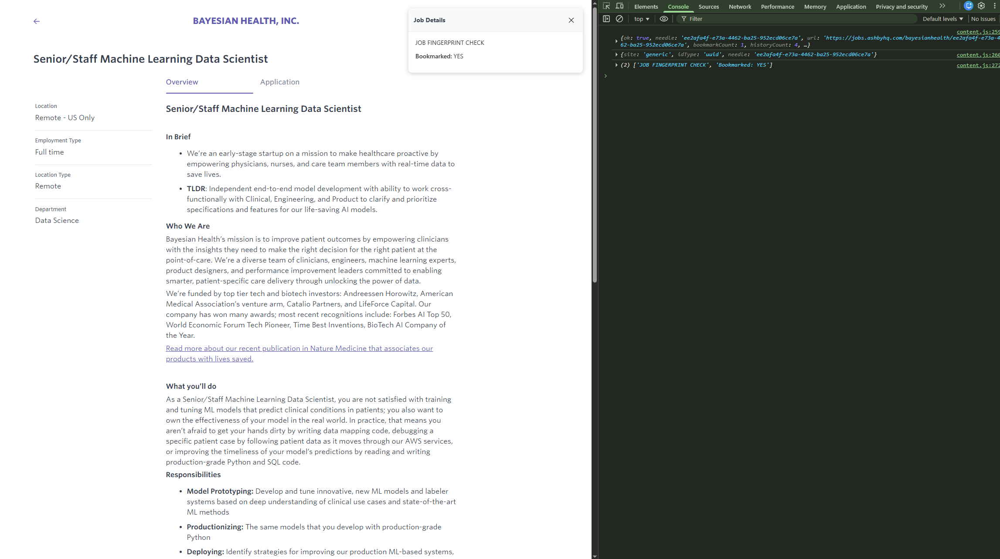

# Job UUID Visit Checker (Chrome Extension)

**What it does**
- On any page load, extracts a **UUID** from the current URL (format: `xxxxxxxx-xxxx-xxxx-xxxx-xxxxxxxxxxxx`).
- Looks for that UUID in **Chrome History** and **Bookmarks**.
- Automatically **copies a summary** to your clipboard and shows a tiny toast.

> If the page URL has no UUID, it still copies a small note saying no UUID was found.

## Install (Unpacked)
1. Download and unzip this folder.
2. Go to `chrome://extensions` and enable **Developer mode**.
3. Click **Load unpacked** and choose the unzipped folder.
4. Visit a job URL that contains a UUID (e.g., Ashby links) — the result is copied automatically.

## Permissions
- `history`: to look up past visits by UUID.
- `bookmarks`: to find bookmark URLs containing the UUID.
- `clipboardWrite`: to copy a summary without a manual click.

## Notes
- This tool only checks UUIDs present **in the URL**. If a job site doesn't put an ID in the URL, you'll see "no UUID found".
- The copy text contains: URL, UUID, visit/bookmark counts, and the last visit timestamp (if any).

